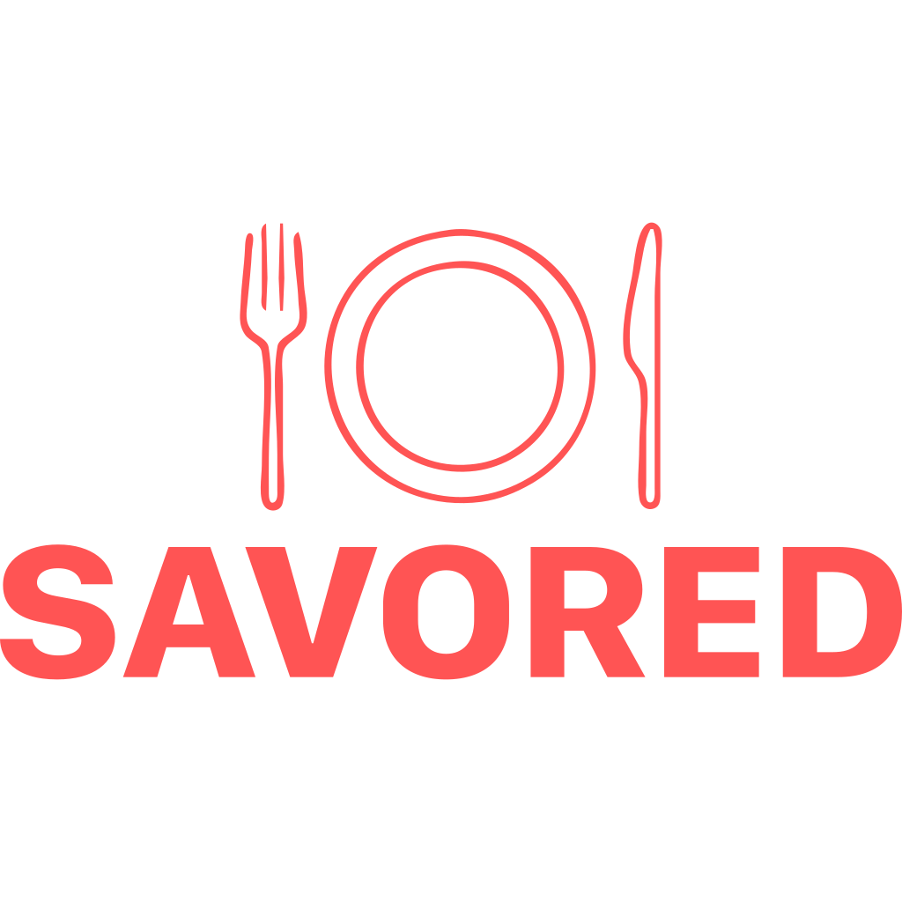
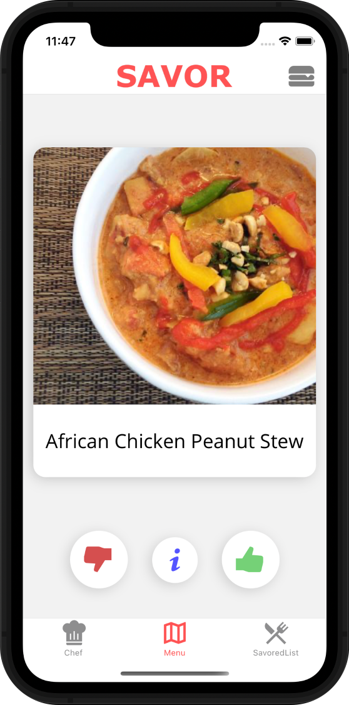
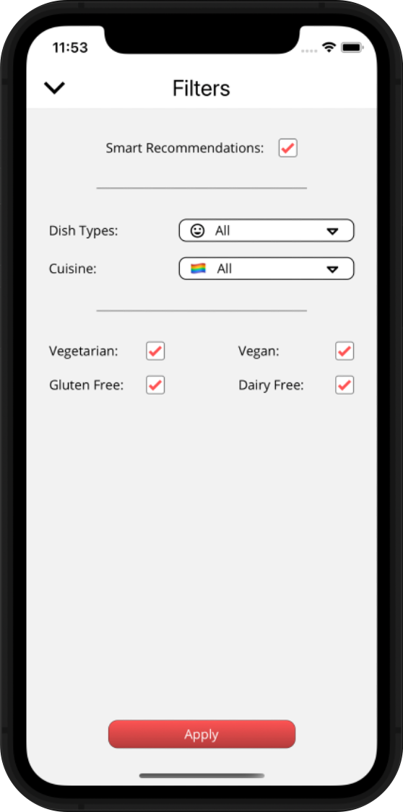
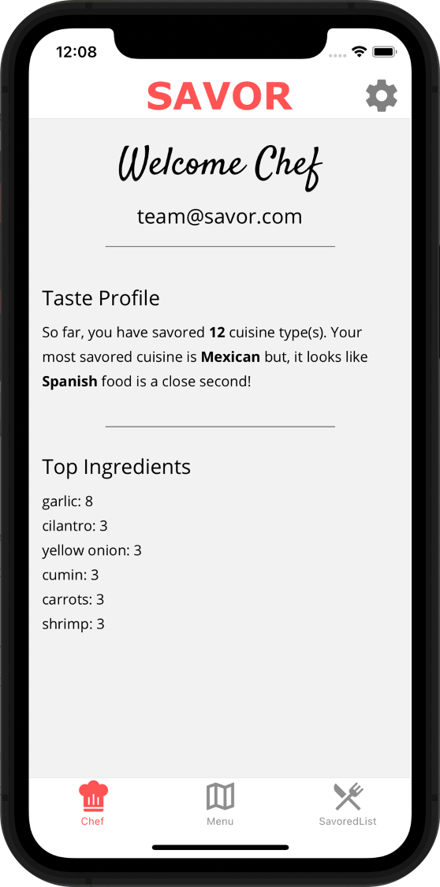
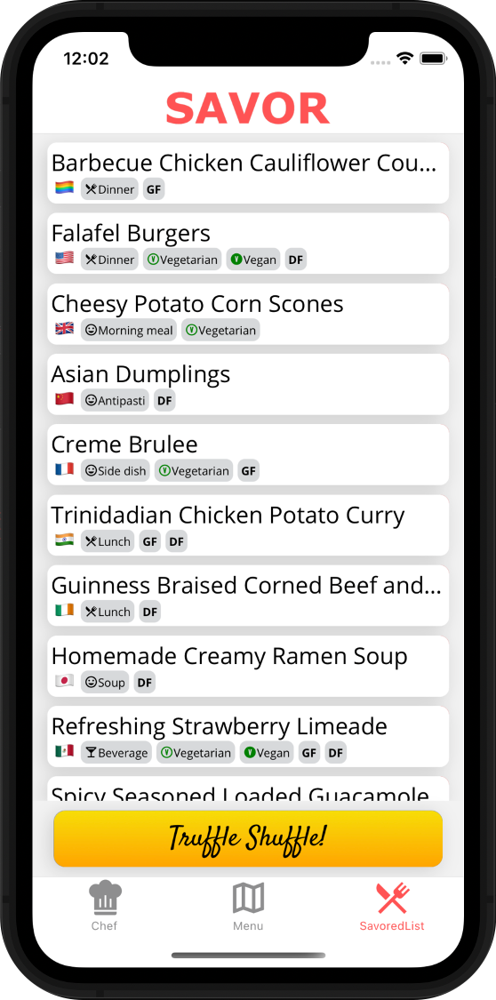
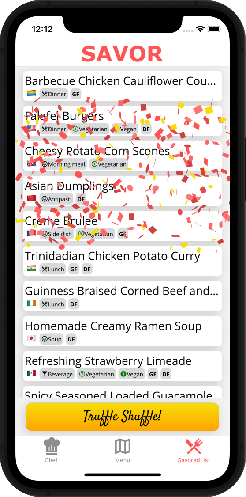
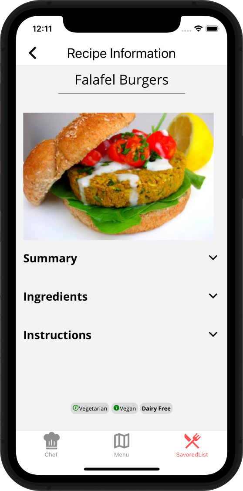

<!-- HEADER -->

<!-- Logo -->
    
<!-- Tagline -->
    

        Food has no boundaries, taste has no limits. 
     
        Swipe and look, Savor to cook.
     
    

<!-- Links -->
    

        <a href="mailto:savor.beta.test@gmail.com">Beta Test</a>
        ·
        <a href="https://github.com/SavorApp/savor-app/issues">Report Bug</a>
    

<!-- BODY -->
# Table of Contents
1. [About](#about)
    * [Core Values](#core-values)
    * [Tech Stack](#tech-stack)
    * [Key Features](#key-features)
2. [Coming Soon](#coming-soon)
    * [Going-Out Mode](#going-out-mode)
    * [Enhanced Machine Learning](#enhanced-machine-learning)
    * [Food Lovers Network](#food-lovers-network)
4. [Contact](#contact)

# About
Savor is a mobile application that is currently open for [beta testing](mailto:savor.beta.test@gmail.com). We are working hard to help with indecisiveness when it comes to coming up with a recipe to cook. Our app lets you easily find and explore over 50,000 recipes from a multitude of cultures so that you can Savor what you eat, while widening your kitchen repertoire. 

## Core Values
### *Food has no boundaries:*
Savor strives to be inspiring and all-inclusive. We accept people, and food, from all backgrounds and cultures. The Savor team loves consuming and recommending food from all over the world. We also work hard to make sure our application is accessible for people that have any dietary requirements.

### *Taste has no limits:*
Food is not limited to just tasting good, it can also be a springboard for you to improve your own life and your surroundings. We believe you can achieve anything you put your mind to. This applies to life and the food you cook. We hope that Savor can help you push your limits and grow as a cook.

### *Swipe and look:*
It's really that simple. Savor was built upon simplicity, efficiency and, delivering a great user experience will always be our top priority. Signing up is not required to get started. Although, once you create an account, you will receive a very personalized experience. 

### *Savor to cook:*
Last but not least, we’d like you to Savor what you eat. We challenge you to be mindful of your eating habits and, to cherish the food you prepare and consume. There is something very special about picking out and preparing your own ingredients, experiencing the act of cooking with all of your senses and, tasting the masterpiece of your own creations.

## Tech Stack
- [TypeScript](https://www.typescriptlang.org/)
- [React Native](https://reactnative.dev/)
- [GraphQL](https://graphql.org/)
- [Firebase](https://firebase.google.com/)
- [PostgreSQL](https://www.postgresql.org/)

## Key features
### *Menu Screen*
This is where you swipe on your recommended recipes, much like a modern dating app.

    
    

        <ul>
            <li/>This is where you swipe on your recommended recipes, much like a modern dating app.
              
            <li/>You may either swipe left or right on recipes or, use the thumbs-down and thumbs-up buttons for a different user experience.
              
            <li/>Click the info button to quickly view information for the given recipe, before making your final decision.
              
            <li/>Click the burger icon in the top-right corner for custom filtering options.
        </ul>
    

### *Custom Filtering*
Savor allows for you to get specific without being a hassle to configure.

    
    

        <ul>
            <li/>This is where you set various filtering options according to your personal preference.
              
            <li/>The Smart Recommendation option allows Savor to recommend recipes that you are more likely to enjoy based on your previous decisions.
              
            <li/>Dish Types allow for you to filter between breakfast, dinner, dessert, beverage, etc.
              
            <li/>Cuisine allows for you to filter between dishes from around the world.
              
            <li/>Finally, we've included filtering options for individuals who might have specific dietary requirements.
        </ul>
    

### *Chef Screen*
This is where you can access information and features regarding your account. We strive to provide users with a personalized experience.

    
    

        <ul>
            <li/>Your Taste Profile is unique to you and, is created based on the recipes you have Savored.
              
            <li/>Your Top Ingredients is another unique feature that is populated based on your Savored recipes.
              
            <li/>Click the gear icon in the top-right corner to access your account settings. 
        </ul>
    

### *Savored List*
This is where you can interact with the recipes you have previously Savored.

    
    

        <ul>
            <li/>Just enough information is displayed for a given recipe.
              
            <li/>The flag represents the recipe Cuisine.
              
            <li/>Individual tags are displayed below the recipe title that quickly tell you all you need to know about a given recipe.
              
            <li/>Click on a recipe to view more information about a given recipe.
              
            <li/>Click the Truffle Shuffle button if you're feeling indecisive!
        </ul>
    

### *Truffle Shuffle*
The infamous Truffle Shuffle button assists the indecisive user by selecting a recipe at random.
<!--  -->

    
    

        <ul>
            <li />A recipe is selected at random, so you don't have to take any extra time to think of something to cook.
              
            <li/>Everyone likes confetti right?
        </ul>
    

### *Recipe Information*
This screen provides you with all you need to prepare your meal.

    
    

        <ul>
            <li/>The title of the recipe is displayed at the top of the screen.
              
            <li/>An image is displayed just below the title
              
            <li/>Summary, Ingredients and Instructions are clickable dropdowns that will expand with further information.
              
            <li/>Recipe tags are displayed at the bottom of the screen.
        </ul>
    

# Coming Soon
### Going-Out Mode
- Currently, our application is in *Staying-In Mode*. This means you are able to swipe left or right on recipes to prepare at home. Imagine the ability to swipe left or right on restaurants in your current location and, Savoring your favorite restaurants!
### Enhanced Machine Learning
- Our machine learning model used for the *Smart Recommendation* feature currently takes into account previously Savored recipe information such as, ingredients. We hope to enhance our machine learning model to use time relevant features such as, time-of-day, day-of-week, holidays, etc. For example, if you're a strong believer in Taco-Tuesday, don't be surprised if you start to see taco recipes on Tuesday night!
### Food Lovers Network
- This would be a simple way to connect with your friends/family on Savor. Share Savored recipes, see what your friends are cooking and, get ready for a more complete profile page!

# Contact
For support, feedback or, to report a bug, you may contact any of the following contributors:
- Johan Thestrup: [GitHub](https://github.com/JohanThestrup), [LinkedIn](https://www.linkedin.com/in/johanthestrup/)
- Gaetan Karst: [GitHub](https://github.com/GaetanKarst), [LinkedIn](https://www.linkedin.com/in/johanthestrup/)
- Mark Herring: [GitHub](https://github.com/Worldonawire), [LinkedIn](https://www.linkedin.com/in/gaetankarst/)
- Yoshio Hasegawa: [GitHub](https://github.com/yoshiohasegawa), [LinkedIn](https://www.linkedin.com/in/yoshiohasegawa/)

## License
Distributed under the MIT License.